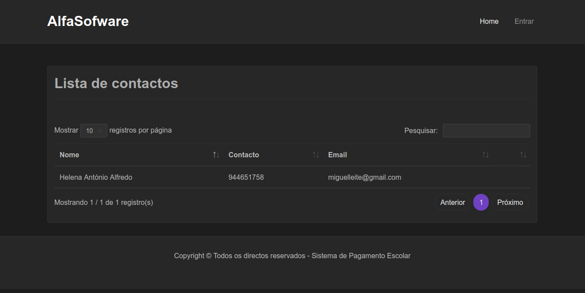
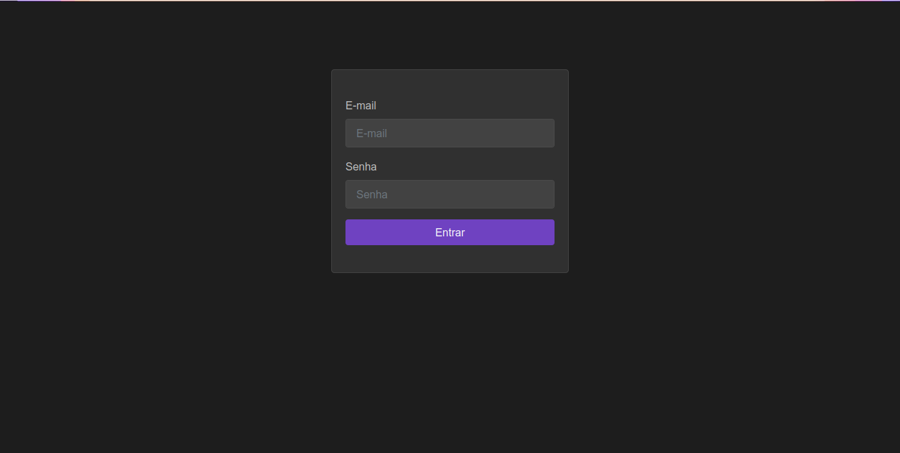
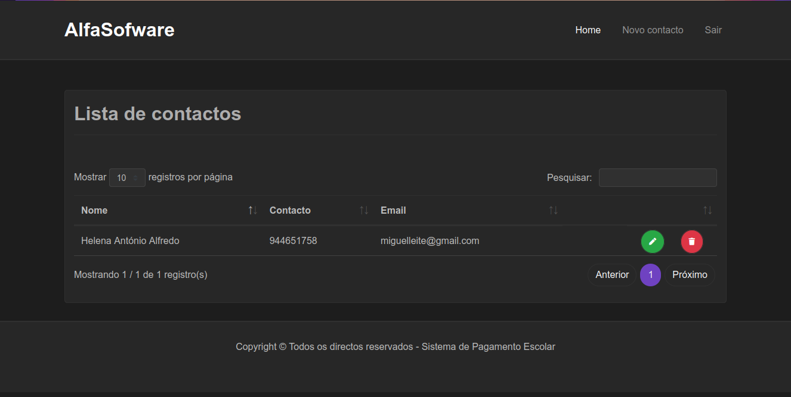
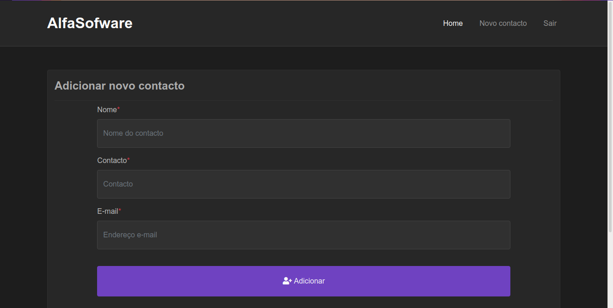

<h1>Contact Manager</h1>

Contact Manager é uma aplicação de gerêncimento de contactos, é um teste que me foi dado pela empresa AlfaSofware.

### Funcionalidades da aplicação
[x] Listar todos contactoa
[x] Criação de novo contacto
[x] Actualização do contacto
[x] Deleção do contacto

### Apresentação da aplicação

Tela inicial (Usuário autenticado / Usuário não autenticado)

Tela de login

Tela para listar contacto (Usuário autenticado)

Tela para adicionar contact (Usuário autenticado)

